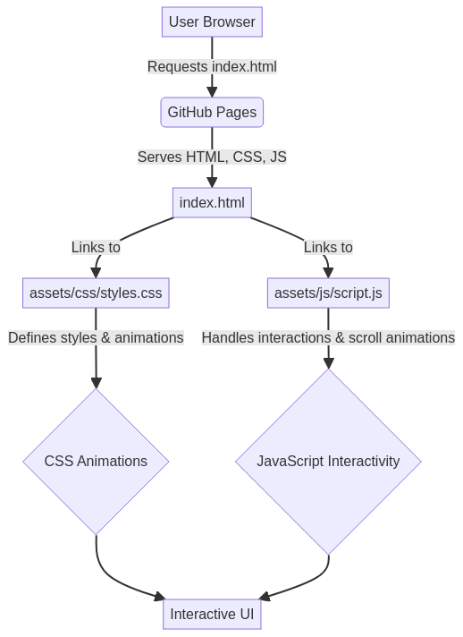
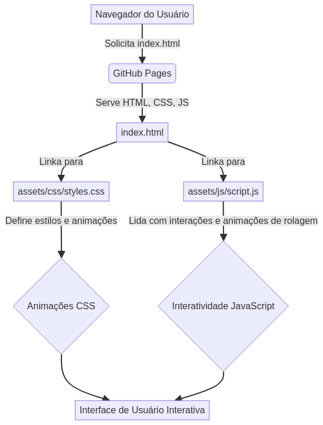

# CSS-Animation-Showcase


## English

### 🚀 Overview

This repository, **CSS-Animation-Showcase**, is a professional collection of modern, responsive, and interactive CSS animations and components. Developed by Gabriel Demetrios Lafis, it serves as a comprehensive resource for learning, referencing, and implementing advanced CSS techniques in web projects. The project emphasizes clean code architecture, performance optimization, and adherence to industry best practices.

### ✨ Features

*   **Diverse Animation Library**: Explore a wide range of CSS animations, from subtle fades to dynamic bounces and flips.
*   **Responsive Design**: All components and animations are fully responsive, ensuring seamless display across various devices and screen sizes.
*   **Interactive Demos**: Each animation includes a live demo and corresponding code snippet for easy understanding and implementation.
*   **Professional Code Architecture**: Organized and maintainable codebase following modern CSS development standards.
*   **Performance Optimized**: Animations are crafted to be smooth and efficient, minimizing impact on page load and rendering performance.
*   **Bilingual Documentation**: Comprehensive documentation available in both English and Portuguese.

### 🛠️ Technology Stack

*   **HTML5**: Semantic markup for structuring web content.
*   **CSS3**: Advanced styling, transitions, keyframes, and animations.
*   **JavaScript**: Minimal scripting for interactive elements and scroll-based animations.

### 🏃‍♂️ Quick Start

To get a local copy up and running, follow these simple steps.

1.  **Clone the repository**:
    ```bash
    git clone https://github.com/galafis/CSS-Animation-Showcase.git
    ```
2.  **Navigate to the project directory**:
    ```bash
    cd CSS-Animation-Showcase
    ```
3.  **Open `index.html` in your browser**:
    Simply open the `index.html` file directly in your preferred web browser to view the showcase.

    Alternatively, you can serve it with a local server (e.g., using Python):
    ```bash
    python -m http.server 8000
    # Then visit http://localhost:8000 in your browser
    ```

### 🎯 Usage Examples

Each animation card on the demo page provides a clickable demo box. Click on any demo box to re-trigger its animation and observe the effect. The corresponding CSS code snippet is also provided for easy integration into your projects.

### 📊 Project Structure

```
CSS-Animation-Showcase/
├── README.md
├── LICENSE
├── index.html
├── assets/
│   ├── css/
│   │   └── styles.css
│   └── js/
│       └── script.js
├── docs/
├── config/
├── tests/
└── .github/
    └── workflows/
```

### 🏗️ Architecture Diagram




### 🤝 Contributing

Contributions are welcome! If you have suggestions for new animations, improvements, or bug fixes, please feel free to submit a Pull Request or open an issue.

### 📄 License

This project is licensed under the MIT License - see the `LICENSE` file for details.

### 👨‍💻 Author

**Gabriel Demetrios Lafis**
*   Data Scientist & Engineer
*   Systems Developer & Analyst
*   Cybersecurity Specialist

---

## Português

### 🚀 Visão Geral

Este repositório, **CSS-Animation-Showcase**, é uma coleção profissional de animações e componentes CSS modernos, responsivos e interativos. Desenvolvido por Gabriel Demetrios Lafis, ele serve como um recurso abrangente para aprender, referenciar e implementar técnicas avançadas de CSS em projetos web. O projeto enfatiza a arquitetura de código limpo, otimização de desempenho e adesão às melhores práticas da indústria.

### ✨ Funcionalidades

*   **Biblioteca Diversificada de Animações**: Explore uma ampla gama de animações CSS, desde fades sutis até saltos e giros dinâmicos.
*   **Design Responsivo**: Todos os componentes e animações são totalmente responsivos, garantindo uma exibição perfeita em vários dispositivos e tamanhos de tela.
*   **Demos Interativas**: Cada animação inclui uma demonstração ao vivo e o snippet de código correspondente para fácil compreensão e implementação.
*   **Arquitetura de Código Profissional**: Base de código organizada e de fácil manutenção, seguindo os padrões modernos de desenvolvimento CSS.
*   **Otimizado para Desempenho**: As animações são criadas para serem suaves e eficientes, minimizando o impacto no carregamento da página e no desempenho de renderização.
*   **Documentação Bilíngue**: Documentação abrangente disponível em inglês e português.

### 🛠️ Stack Tecnológica

*   **HTML5**: Marcação semântica para estruturar o conteúdo da web.
*   **CSS3**: Estilização avançada, transições, keyframes e animações.
*   **JavaScript**: Scripting mínimo para elementos interativos e animações baseadas em rolagem.

### 🏃‍♂️ Início Rápido

Para ter uma cópia local e funcionando, siga estes passos simples.

1.  **Clone o repositório**:
    ```bash
    git clone https://github.com/galafis/CSS-Animation-Showcase.git
    ```
2.  **Navegue até o diretório do projeto**:
    ```bash
    cd CSS-Animation-Showcase
    ```
3.  **Abra `index.html` no seu navegador**:
    Basta abrir o arquivo `index.html` diretamente no seu navegador web preferido para visualizar o showcase.

    Alternativamente, você pode servi-lo com um servidor local (por exemplo, usando Python):
    ```bash
    python -m http.server 8000
    # Em seguida, visite http://localhost:8000 no seu navegador
    ```

### 🎯 Exemplos de Uso

Cada cartão de animação na página de demonstração oferece uma caixa de demonstração clicável. Clique em qualquer caixa de demonstração para reativar sua animação e observar o efeito. O snippet de código CSS correspondente também é fornecido para fácil integração em seus projetos.

### 📊 Estrutura do Projeto

```
CSS-Animation-Showcase/
├── README.md
├── LICENSE
├── index.html
├── assets/
│   ├── css/
│   │   └── styles.css
│   └── js/
│       └── script.js
├── docs/
├── config/
├── tests/
└── .github/
    └── workflows/
```

### 🏗️ Diagrama de Arquitetura




### 🤝 Contribuindo

Contribuições são bem-vindas! Se você tiver sugestões para novas animações, melhorias ou correções de bugs, sinta-se à vontade para enviar um Pull Request ou abrir uma issue.

### 📄 Licença

Este projeto está licenciado sob a Licença MIT - veja o arquivo `LICENSE` para detalhes.

### 👨‍💻 Autor

**Gabriel Demetrios Lafis**
*   Cientista e Engenheiro de Dados
*   Desenvolvedor e Analista de Sistemas
*   Especialista em Segurança Cibernética

---

⭐ **Se este projeto foi útil para você, considere dar uma estrela!**
